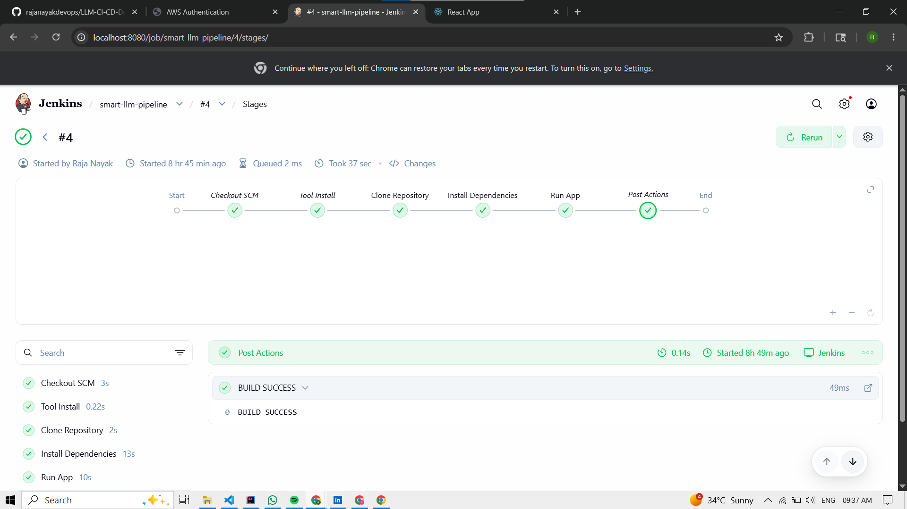
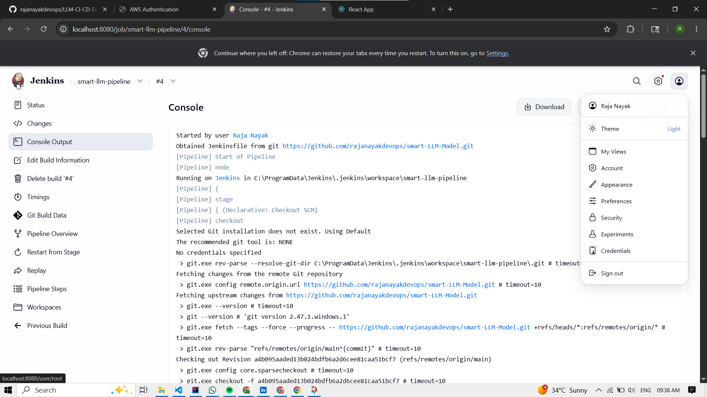
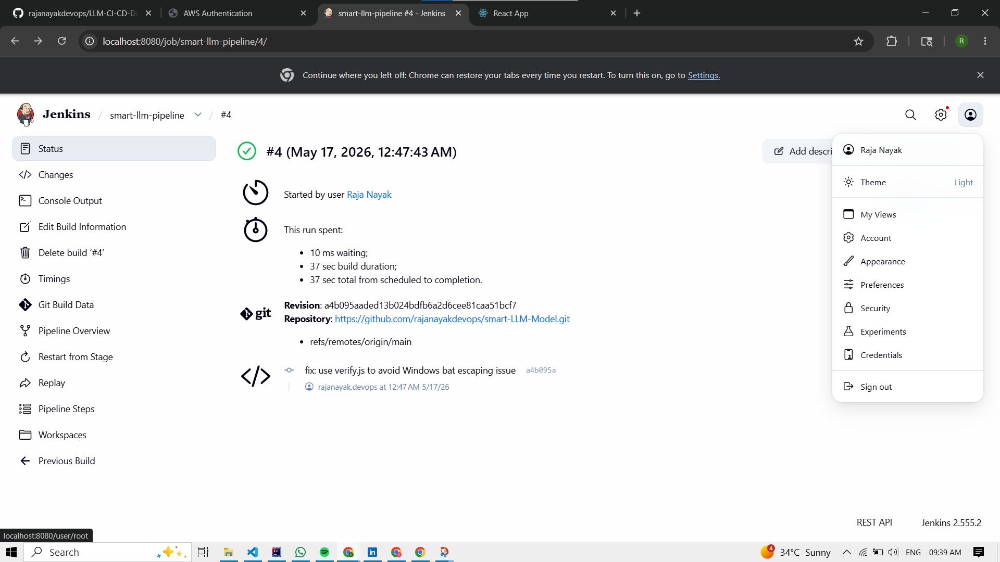
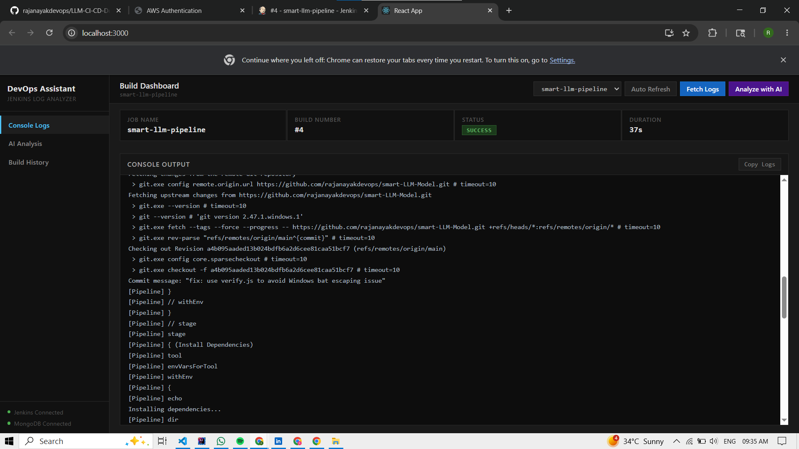
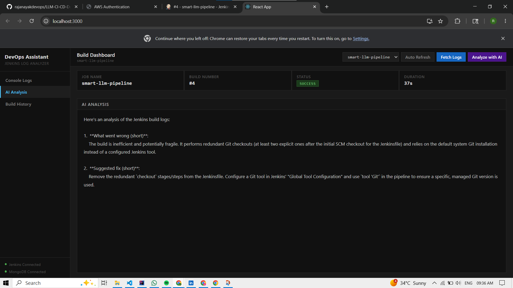
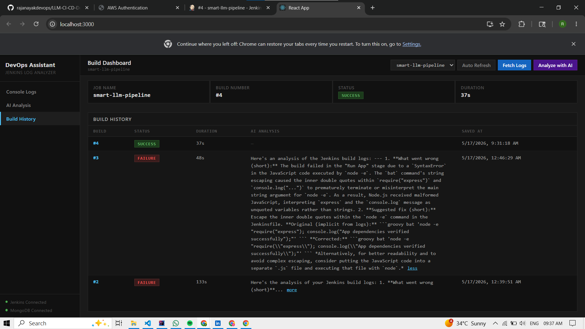

# LLM CI/CD DevOps Assistant

Anyone who's worked with CI/CD pipelines knows the pain — a build fails, and now you're scrolling through hundreds of lines of logs trying to figure out what actually went wrong. This project was built to fix that.

---

## The problem it solves

Build failures are a normal part of development.

The frustrating part isn't that they happen — it's the time spent figuring out *why*.

Raw Jenkins logs are often noisy, large, and difficult to scan quickly. Important errors are usually buried between dependency downloads, stack traces, and unrelated console output.

This tool shortens that debugging cycle by extracting the meaningful failure reason and presenting it in a readable format within seconds.

---

## How it works

1. User selects a Jenkins job
2. Application fetches the latest build logs from Jenkins
3. Logs are sent to Gemini AI for analysis
4. AI identifies the failure reason and possible fixes
5. Build details and AI analysis are stored in MongoDB
6. User can review build history and recurring failures

---

## Screenshots

### Jenkins Dashboard

  

  

  

### Console Output

  

### AI Analysis

  

### Build History

  

---

## What it does

The assistant connects to your Jenkins instance, pulls the latest build logs, and runs them through Gemini AI. Instead of reading through raw stack traces and cryptic error messages, you get a plain-English breakdown of what failed and what you should do about it.

That's the core of it. But there's a bit more going on:

### Jenkins Integration

The application communicates directly with Jenkins using its REST APIs.

No copy-pasting logs. The assistant automatically fetches:

* Latest build logs
* Build status
* Build duration
* Console output
* Job history

You simply select the Jenkins job, and the system handles the rest.

---

### AI-Powered Failure Analysis

The logs are analyzed using Gemini 2.5 Flash with a focused debugging prompt.

Instead of dumping technical output back to the user, the AI:

* Identifies the actual root cause
* Explains the failure in human-readable language
* Suggests possible fixes
* Highlights important log sections

The goal is to reduce the time spent manually debugging Jenkins builds.

---

### Persistent Build History

Every analyzed build gets stored in the database along with:

* Build metadata
* Jenkins job information
* Build status
* Console logs
* AI-generated analysis

This creates a searchable history of failures and analyses over time.

---

### Pattern Tracking

The assistant stores the latest builds for each Jenkins job, making recurring failures easier to spot.

If the same dependency issue, test failure, or deployment problem appears repeatedly, it becomes obvious when viewing previous analyses side by side.

---

### Browser-Based Log Analysis

The project also includes a lightweight UI for manual testing.

Users can paste raw logs directly into the interface and instantly receive AI-generated failure analysis without connecting to Jenkins.

---

## Tech Stack

* Java
* Spring Boot
* Jenkins REST API
* Gemini 2.5 Flash API
* MongoDB
* Maven
* HTML / CSS / JavaScript

---

## What it doesn't do

This project is designed as an internal developer tool.

It is not intended to be publicly exposed, and it does not automatically modify pipelines or apply fixes on its own.

The AI provides analysis and debugging assistance, while the developer remains in control of the actual solution and deployment decisions.
